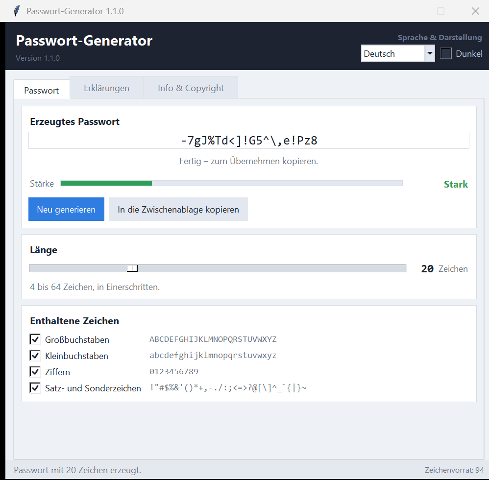
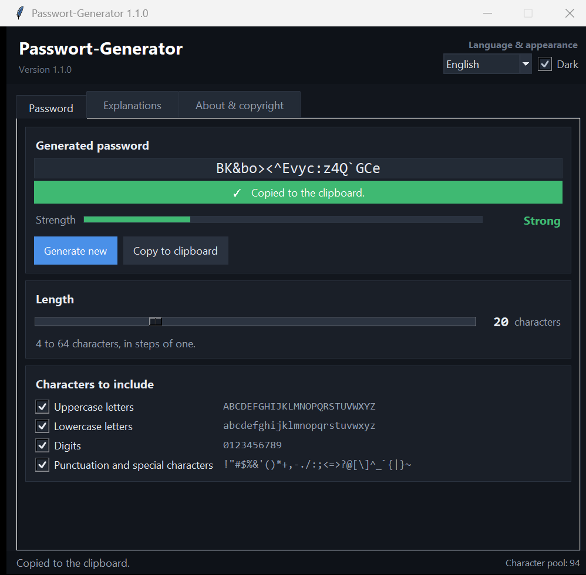

# Password Generator

A password generator for Windows with a slider for the length, a colour-coded
strength bar and one click to the clipboard. The interface comes in German and
English, light and dark, and remembers every setting until the next start.

*[Deutsche Fassung: README.md](README.md)*



## What it does

- **Length from 4 to 64 characters**, in steps of one on the slider.
- **Strength bar**: red up to 8 characters, yellow at 9 and 10, green from 11.
- **Character selection** by tick box – uppercase letters, lowercase letters,
  digits, punctuation and special characters. Every ticked group appears at
  least once as long as the length allows, so a password will not be rejected
  by a form that insists on a digit.
- **Copy to clipboard**, with a green confirmation that withdraws itself after
  three seconds.
- **German and English**, light and dark scheme – both switchable without the
  window changing at all.
- **Settings are kept**: length, character selection, language, scheme and
  window position live in a JSON file next to the program.



## Running it

**As a program:** download `Passwort-Generator.exe` from the
[releases](../../releases) and start it. Nothing is installed; the settings
file appears next to it when you first close the window.

> **On first start**: the executable is not signed, so Windows SmartScreen
> asks once – "More info" → "Run anyway". Antivirus software also tends to
> hold on to a freshly downloaded, unknown file for a few seconds while it
> scans it; starting the program during that time may fail with "Access
> denied". Wait a moment and start it again. To be on the safe side, compare
> the SHA-256 checksum from the release notes first.

**As a script:** double-click `Passwort-Generator.pyw`. All it needs is Python
3.10 or newer with Tkinter, which ships with the Windows installer. No further
packages are required.

```bash
python Passwort-Generator.pyw
```

## Keys

| Key | Effect |
|---|---|
| `F5` | generate a new password |
| `Ctrl`+`C` | put the password on the clipboard |

## How the password is made

The characters are drawn with the operating system's random generator –
Python's [`secrets`](https://docs.python.org/3/library/secrets.html) module,
which is meant for passwords and keys. One character comes from each ticked
group first, the rest is drawn from the whole pool, and finally the order is
shuffled with `secrets.randbelow`.

The generated password is never written down; it is gone once the window
closes. The settings file only holds length, character selection, language,
scheme and window position.

## Adding a language

German is the source language: the German text in the code is also the key.
`LANGUAGE_NAMES` and `TRANSLATIONS` sit at the end of
`Passwort-Generator.pyw`. Add a code to `LANGUAGE_NAMES`, add a section to
`TRANSLATIONS`, and the selector in the top right offers the language right
away. Untranslated lines fall back to German automatically.

## Building it yourself

```bash
pip install pyinstaller
build.cmd
```

The result is `dist\Passwort-Generator.exe`. The program icon can be recreated
with `python icon_erzeugen.py`, which needs Pillow.

## Licence

[MIT](LICENSE) – Copyright 2026 Alexander Unverhau.
Created with assistance of Claude AI.
